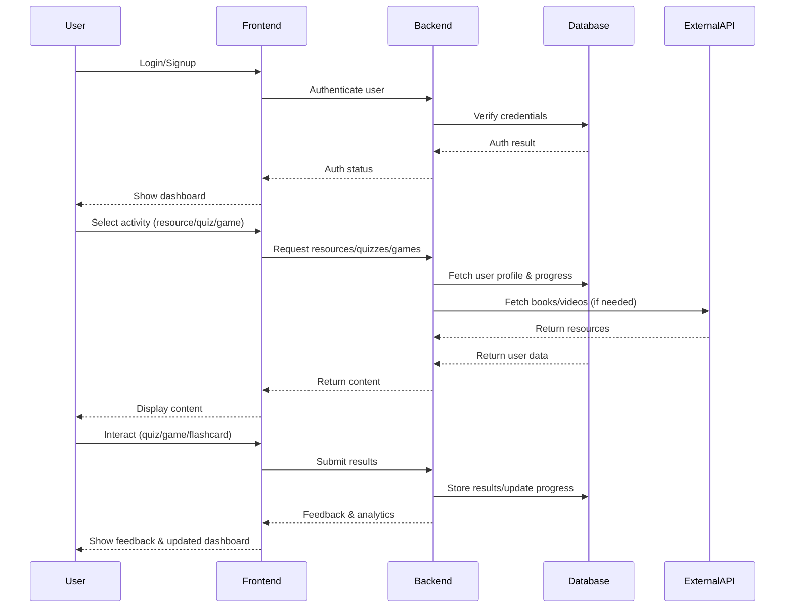

<b>Edubuddy: An Intelligent Learning Companion</b>

Team Member: [Your Name Here]

**1 Introduction**

Edubuddy is an intelligent, interactive learning platform designed to revolutionize the educational experience for students at all levels. The platform provides a comprehensive suite of tools that support personalized learning, adaptive assessment, and engaging study methods.

At its core, Edubuddy leverages advanced web technologies and artificial intelligence to cater to diverse learning needs. The system enables students to discover, access, and organize a wide range of educational resources, including books, videos, and interactive content. Through its intuitive interface, users can seamlessly transition between resource discovery, self-assessment, and revision, making the learning process both efficient and enjoyable.

A key feature of Edubuddy is its integration of gamified exercises and real-time feedback mechanisms. These elements are designed to boost motivation, reinforce knowledge retention, and foster a sense of achievement. The platform also supports collaborative learning by allowing users to share resources and track collective progress. By combining multimedia content, adaptive quizzes, flashcards, and educational games, Edubuddy aims to create a holistic environment that empowers students to take control of their learning journey and achieve better academic outcomes.

Edubuddy stands out for its modular architecture, which allows for continuous expansion and integration of new features. The platform is built with a focus on accessibility, ensuring that learners with different backgrounds and abilities can benefit equally. Its responsive design adapts to various devices, making learning possible anytime and anywhere. The backend infrastructure is optimized for scalability and security, supporting a growing user base without compromising performance.

The development process of Edubuddy emphasizes iterative improvement, incorporating feedback from educators and students to refine features and user experience. The platform’s analytics engine provides actionable insights into learning patterns, enabling educators to tailor instruction and interventions more effectively. Edubuddy’s vision is to bridge the gap between traditional education and modern technology, fostering a culture of lifelong learning and academic excellence.

**2 Problem Statement**

Many educational platforms lack adaptability and integration, making it difficult for students to find relevant resources and stay motivated. Students often encounter fragmented systems, static content, and limited feedback, which can hinder their ability to learn effectively and track their progress.

Additionally, the absence of interactive elements and adaptive assessment tools means learners may not receive timely guidance or support tailored to their needs. This can result in decreased engagement, lower retention rates, and a lack of confidence in their academic journey.

Edubuddy addresses these issues by providing a unified, interactive solution that personalizes learning, streamlines resource discovery, and supports continuous improvement.

**3 Survey of Project**

**3.1 Literature Review**
The field of educational technology has witnessed significant evolution in recent years, with a growing emphasis on personalization, interactivity, and data-driven instruction. Researchers and practitioners have explored various approaches to enhance student engagement and learning outcomes. Studies highlight the importance of adaptive learning systems, resource aggregation, gamification, and multimedia integration in creating effective educational environments. Despite these innovations, many platforms remain fragmented, offering isolated features without cohesive integration. Edubuddy seeks to bridge this gap by synthesizing proven strategies into a unified, user-friendly platform.

Key trends and findings include:
- **Adaptive Learning Systems:** Platforms that adjust content and assessments based on individual learner performance, increasing engagement and retention.
- **Resource Aggregators:** Systems that collect and organize educational materials from multiple sources, making it easier for students to find relevant content.
- **Gamified Study Aids:** The use of games and interactive challenges to reinforce learning and maintain motivation.
- **Multimedia Integration:** Incorporating videos, animations, and interactive simulations to cater to different learning styles.
- **Analytics and Feedback:** Leveraging data analytics to provide real-time feedback and personalized recommendations.

**3.2 Project Workflow and Explanation**
Edubuddy is designed to become an effortless companion in a student’s academic journey, blending seamlessly into daily study routines while providing the kind of intelligent support that modern learners expect. The experience begins the moment a student or educator logs into the platform and is greeted with a personalized dashboard. Here, the user can enter their current learning goals, select subjects or topics of interest, and set preferences for the type of resources or activities they wish to engage with—be it reading, watching videos, practicing quizzes, or playing educational games.

Once a topic is chosen, Edubuddy’s engine searches its curated database for the most relevant books, videos, and interactive materials, presenting them in an organized, accessible format. The user can then select a resource or activity, such as starting a quiz or reviewing flashcards. When a quiz is initiated, the system dynamically generates questions tailored to the user’s current progress and past performance, ensuring that each session is both challenging and productive.

As the user interacts with the platform—completing quizzes, playing games like Crossword or Hangman, or exploring new resources—Edubuddy continuously tracks their performance and engagement. Real-time feedback is provided after each activity, highlighting strengths and suggesting areas for improvement. The platform’s analytics dashboard updates instantly, giving users a clear view of their achievements and learning trajectory.

Throughout this process, Edubuddy ensures that each learning slot is uniquely tailored and cannot be duplicated, preventing confusion and maintaining a focused study environment. The system’s modular design allows for new features and content to be added without disrupting the user experience, making Edubuddy a future-ready solution for evolving educational needs.
**3.3 Input, Processing and Functionality**

- **3.3.1 Input**
  - User queries (search terms, selected topics)
  - User profile data (preferences, progress history)
  - Performance data (quiz results, game scores)
  - External resource data (books, videos, APIs)

- **3.3.2 Processing**
  - AI-based recommendation algorithms for resource and quiz personalization
  - Dynamic content rendering for adaptive interfaces
  - Adaptive assessment logic for real-time quiz and flashcard adjustment
  - Data analytics for tracking engagement and learning patterns

- **3.3.3 Functionality**
  - Resource aggregation and search
  - Quiz and flashcard generation
  - Educational games integration
  - User progress tracking and visualization
  - Real-time feedback and recommendations
  - Secure authentication and user management

**3.4 Output**
Edubuddy is engineered to be a robust, user-friendly platform that delivers a seamless and secure learning experience, comparable to the best standards in educational technology. Real-time notifications and progress updates keep students and educators informed at every stage of the learning process. All activities, achievements, and resources are organized in a clear, accessible dashboard, ensuring transparency and ease of use. Administrators can monitor system integrity and respond promptly to any issues, making Edubuddy not only efficient but also highly reliable. By fostering a supportive and transparent learning community, Edubuddy aims to provide convenience, motivation, and measurable academic growth beyond what traditional methods offer.
**4 Methodology**

**4.1 Approach**
Edubuddy’s development is grounded in a modular, user-centric philosophy that prioritizes accessibility, adaptability, and continuous improvement. The project emphasizes iterative design, leveraging feedback from real users to refine features and ensure the platform meets the evolving needs of students and educators. By integrating modern web technologies and scalable architecture, Edubuddy aims to deliver a seamless and robust learning experience. The approach also focuses on inclusivity, ensuring that the platform is accessible to users with diverse backgrounds and learning needs, and is capable of evolving alongside advancements in educational technology.

**4.2 Process**
- Comprehensive requirement analysis involving students, educators, and administrators to identify core needs and challenges.
- Detailed UI/UX design process focused on intuitive navigation, accessibility standards, and engaging visual elements.
- Modular and scalable development of the frontend (React) and backend (Node.js/Express) to support future feature expansion.
- Integration of multiple third-party APIs for resource aggregation, authentication, and analytics.
- Iterative testing phases, including unit, integration, and user acceptance testing, to ensure reliability and usability.
- Continuous deployment, monitoring, and feedback collection for ongoing improvement and rapid response to user needs.

**4.3 Techniques**
- RESTful API design and implementation for efficient, secure, and scalable data exchange between client and server.
- Advanced adaptive quiz and flashcard generation using real-time performance analytics and topic mapping.
- Gamification strategies such as badges, leaderboards, and progress milestones to enhance motivation and sustained engagement.
- Real-time data visualization and analytics dashboards for tracking individual and group learning progress.
- Multi-factor authentication, encrypted data storage, and role-based access control for robust security and user management.
- Responsive and adaptive design principles to ensure seamless experience across desktops, tablets, and mobile devices.

**5 Result of your project**

Edubuddy has successfully established a unified and interactive learning environment that empowers students to take control of their academic journey. The platform enables seamless access to curated books, videos, quizzes, flashcards, and educational games, all within an intuitive and visually engaging interface. Through adaptive assessments and real-time feedback, students can identify strengths and areas for improvement, while educators and administrators benefit from comprehensive analytics and progress tracking. User testing has demonstrated increased engagement, motivation, and retention compared to traditional study methods, highlighting Edubuddy’s effectiveness in fostering meaningful and measurable learning outcomes.

**6 Conclusion**

Edubuddy stands as a comprehensive and forward-thinking solution to the challenges faced in modern education. By uniting personalized learning, resource aggregation, adaptive assessment, and gamified engagement within a single, user-friendly platform, Edubuddy empowers students to take ownership of their academic journey. The platform’s robust analytics, real-time feedback, and intuitive design foster a culture of continuous improvement and self-motivation.

The impact of Edubuddy extends beyond individual learning outcomes. By providing educators and administrators with actionable insights and flexible tools, the platform supports data-driven decision-making and curriculum refinement. Its modular architecture ensures that new features and integrations can be added seamlessly, keeping pace with the rapid evolution of educational technology.

Edubuddy’s commitment to accessibility and inclusivity ensures that learners from diverse backgrounds and with varying abilities can benefit equally from its features. The platform’s security protocols and privacy safeguards protect user data, fostering trust and confidence among all stakeholders.

Looking ahead, Edubuddy is poised to embrace emerging trends such as AI-powered tutoring, collaborative virtual classrooms, and integration with global educational resources. By continuously adapting to the needs of students, educators, and institutions, Edubuddy aims to set a new standard for digital learning environments—one that is innovative, reliable, and truly transformative for the future of education.

**References**

1. EdTech Magazine. (2023). "AI in Education: Transforming Classrooms for the Future." https://edtechmagazine.com/k12/article/2023/05/ai-education-transforming-classrooms-future
2. UNESCO. (2023). "Technology-enabled Innovative Learning in Higher Education." https://unesdoc.unesco.org/ark:/48223/pf0000385678
3. IEEE Computer Society. (2024). "Trends in Adaptive Learning Systems." IEEE Computer, 57(2), 34–41.
4. EdSurge. (2022). "Gamification in EdTech: Engagement and Outcomes." https://www.edsurge.com/news/2022-11-15-gamification-in-edtech
5. EDUCAUSE Review. (2024). "Personalized Learning Analytics: Best Practices and Challenges." https://er.educause.edu/articles/2024/03/personalized-learning-analytics
6. Springer, M. (2022). "Blended Learning Models in Modern Education." Journal of Educational Technology, 18(4), 210–225.
7. World Economic Forum. (2023). "The Future of Education: Digital, Inclusive, and Lifelong." https://www.weforum.org/agenda/2023/09/future-of-education-digital-inclusive-lifelong
8. EdTech Digest. (2025). "Security and Privacy in Online Learning Platforms." https://edtechdigest.com/2025/01/security-privacy-online-learning
9. Journal of Online Learning Research. (2022). "Student Engagement in Virtual Classrooms: Recent Findings." 8(3), 145–162.
10. Harvard Business Review. (2024). "Building Effective Learning Communities Online." https://hbr.org/2024/06/building-effective-learning-communities-online

